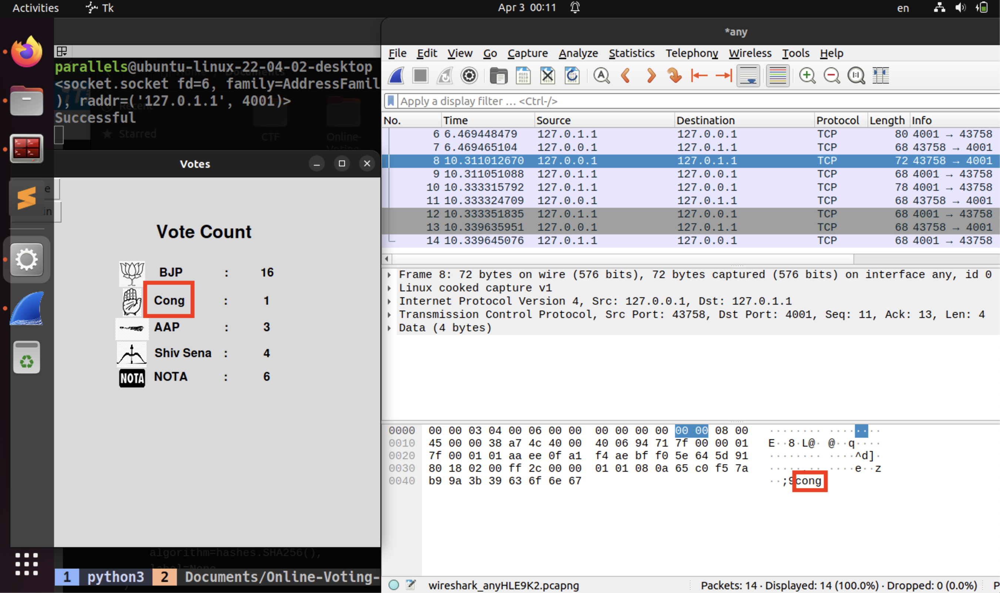

# Cryptography Engineering Crit. 2 Online Voting System Implement

- 系所：資訊科學工程研究所(博)
- student id : 412551016,412551010, 411551012
- Name : 張翔瑋, 林峻賢, 林哲偉

## 01-Requirement
- OS
    - Linux系列作業系統
        - Linux
        - Ubuntu 22.04 (Recommend)
        - Kail
        - etc
- python
    - pandas
    - tkinter
    - subprocess
    - socket

- you can install the python library by typing the command below
    - Navigate to Project(code) folder
      ```sh=
      chmod +x requirement.sh
      sudo ./requirement.sh

      ```
## 02-系統說明
### 架構                                                                                                                                                   
.                                                                                                                                                                                                                                                                                                                                                                                                                                    
├── LICENSE                                                                                                                                                                                                                                                                                                                                                                                                                          
├── Readme.md                                                                                                                                                                                                                                                                                                                                                                                                                        
├── client                                                                                                                                                                                                                                                                                                                                                                                                                           
│   ├── Admin.py                                                                                         
│   ├── Report.pdf                                                                                       
│   ├── ShowVotes.py                                                                                     
│   ├── VotingPage.py                                                                                    
│   ├── __pycache__                                                                                      
│   │   ├── Admin.cpython-310.pyc                                                                        
│   │   ├── ShowVotes.cpython-310.pyc                                                                    
│   │   ├── VotingPage.cpython-310.pyc                                                                   
│   │   ├── admFunc.cpython-310.pyc                                                                      
│   │   ├── dframe.cpython-310.pyc                                                                       
│   │   ├── registerVoter.cpython-310.pyc                                                                
│   │   └── voter.cpython-310.pyc                                                                        
│   ├── admFunc.py                                                                                       
│   ├── database                                                                                         
│   │   └── cand_list.csv                                                                                
│   ├── dframe.py                                                                                        
│   ├── homePage.py                                                                                      
│   ├── img                                                                                              
│   │   ├── dpp.jpg                                                                                      
│   │   ├── kmt.jpg                                                                                      
│   │   ├── kp.jpg                                                                                       
│   │   ├── lin.jpg                                                                                      
│   │   └── lisa.jpg                                                                                     
│   ├── public_key.pem                                                                                   
│   ├── registerVoter.py                                                                                 
│   ├── solve.py                                                                                         
│   └── voter.py                                                                                         
├── doc_fig                                                                                              
│   ├── admin_home.png                                                                                   
│   ├── admin_login.png                                                                                  
│   ├── admin_show.png                                                                                   
│   ├── client_home.png                                                                                  
│   ├── encrypt_vote.png                                                                                 
│   ├── home_server.png                                                                                  
│   ├── id_login.png                                                                                     
│   ├── non-encrypt_vote.png                                                                             
│   ├── reg_success.png                                                                                  
│   ├── reg_voter.png                                                                                    
│   ├── server_wait.png                                                                                  
│   ├── vote_success.png                                                                                 
│   ├── voter_error.png                                                                                  
│   ├── voter_login.png                                                                                  
│   ├── voter_show.png                                                                                   
│   └── voter_vote.png                                                                                   
├── requirement.sh                                                                                       
└── server                                                                                               
    ├── Admin.py                                                                                         
    ├── Server.py                                                                                        
    ├── VotingPage.py                                                                                    
    ├── __pycache__                                                                                      
    │   ├── Admin.cpython-310.pyc                                                                        
    │   ├── VotingPage.cpython-310.pyc                                                                   
    │   ├── admFunc.cpython-310.pyc                                                                      
    │   ├── dframe.cpython-310.pyc                                                                       
    │   ├── dframe.cpython-38.pyc                                                                        
    │   ├── key.cpython-310.pyc                                                                          
    │   ├── registerVoter.cpython-310.pyc                                                                
    │   └── voter.cpython-310.pyc                                                                        
    ├── admFunc.py                                                                                       
    ├── database                                                                                         
    │   ├── cand_list.csv                                                                                
    │   └── voterList.csv                                                                                
    ├── dframe.py                                                                                        
    ├── homePage.py                                                                                      
    ├── img                                                                                              
    │   ├── dpp.jpg                                                                                      
    │   ├── kmt.jpg                                                                                      
    │   ├── kp.jpg                                                                                       
    │   ├── lin.jpg                                                                                      
    │   └── lisa.jpg                                                                                     
    ├── private_key.pem                                                                                  
    ├── public_key.pem                                                                                   
    ├── registerVoter.py                                                                                 
    └── voter.py
### 功能
1. Project區分server及client兩個部分
2. Server端有以下功能
    - 管理員功能
    - 註冊投票者  
        資料儲存在/server/database/voterList.csv
    - 檢視及更新投票數據  
        資料儲存在/server/database/cand_list.csv
    - 生成private key 及public key
3. Client端有以下功能
    - 投票者登入
    - 投票
    - 檢視投票數據  
        同步server端cand_list.csv，並顯示投票數據
4. 線上投票必須保證兩件事
    - 身分驗證  
    投票者一律由server端註冊，server再將登入帳密以電子郵件或其他方式告知投票者。
    

    - 投票保密  
    我們必須保證投票者投完票後，其結果在傳輸過程中必須經過加密保護其投票內容不外流及修改，確保其完整性(Integrity)及機密性 (Confidentiality)。因此，我們透過RSA加密方式，投票者在登入系統後會從Server端接受public key。投票者在完成投票後使用public key進行加密，server收到後使用private key解密，並將結果更新到統計數據。
        - 選票未加密
    
        - 選票已加密
        

## 03-Login ID & password
### server side
- Admin Login :
    - Admin ID : `Admin`
    - Password : `admin`
### client side
- Client Login:
    - Voter Login:
        - Server should be running for voters to be able to login.
        - Already registered voter IDs : 10001 ~
        - Password (for already registered voters) : abcd
        - or you can ask server admin to check `database/voterList.csv` to get the ID and password

## 04-Workflow Description
- Inorder Description to run & test this project :
    - Server
        1. Open terminal & run `python3 homePage.py` to open Home Page Window.
           
        2. Log into Admin
           
           
        3. Press `Register Voter` and enter details to register a new voter. Remember or note down the `Voter ID` that you will receive on successful registration.
           
        4. Press `Home` to return to the Home.
           
        5. Open terminal & run `python3 Server.py` to start server. At the same time, the server will generate a private key and a public key, and listen on the port to wait for a connection.
           
    - Client
        1. Open terminal & run `python3 homePage.py` to open Home Page Window. When the client connects to server, the server will transfer the public key to client.
           
        2. Now, press `Voter Login` to open the voter login page.
           
        3. Enter the login details and you are redirected to the Voting Page. You will receive an error message if the Voter is invalid or has already cast a vote.
           
        4. Cast a Vote. Client will encrypt the vote result by public key and transfer the result to server. Now on receiving a success message, press home to return to home.
           
           
        5. Login voter again to see the votes results.
           
           

